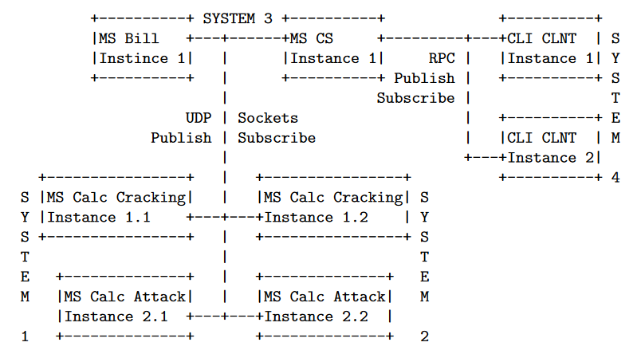

## Distributed Systems Engineering SS2022 - Team project

**Semester Project: (Simulated) Distributed Security Suite**

Apply DSE to tackle a simplified, yet realistic, security focused scenario from the distributed security domain: the cracking of encrypted data (known-plaintext attack) and passwords (hash-cracking). Your design must permit flexible service communication and integration, concurrent task execution/communication, along with billing and management. System quality will be increased by motivating design decisions and applying behaviour driven development1. Microservices2 match perfectly to this scenario. Thus, the project consists of MicroServices (MS), CLieNTs (CLNT), and a central Communication Service (CS).

### Network Layout:

Example layout showing the minimum instance amount. CLI CLNT instances use RPC to communicate with the MS CS. Other MS instances use UDP sockets.

